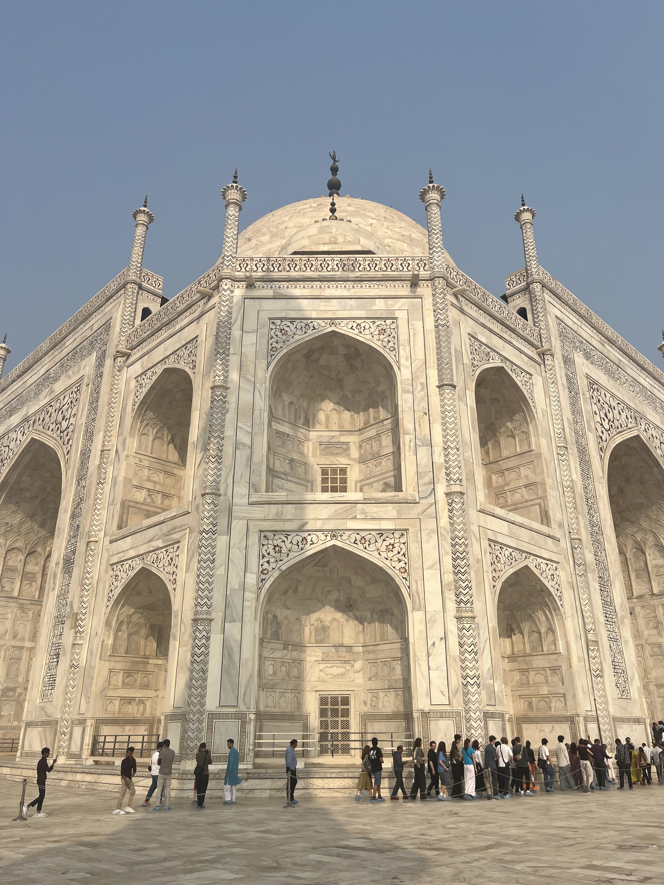

# GIG Assessment 5
## Week 1
### Intercultural experiences
The biggest and most confronting partially cultural difference between Australia and India was the disparity in wealth and the proximity of vastly different socioeconomic groups. For example, I walked out of a high-end mall and was met by begging children within a few steps. We still have significant wealth inequality in Australia, but socioeconomic groups are typically separated with a wealth gradient between them.

Another major cultural difference was the relative chaos of Delhi. Cows and dogs lying in random traffic islands, traffic rules seeming nonexistent, and open construction areas. A local insight session speaker reminded us to not conflate Delhi's cultural chaos with its dirtiness though.

### Teamwork
We decided on the topic of mass urbanisation quickly as we agreed that it was the largest and most varied topic. This ended up being a bit of a curse later on, but I still think it was the right choice in the moment. We also quickly decided on our initial framing, "the problem is that Delhi's rapid urbanisation has resulted in a lack of adequate housing". It seemed like a straightforward and broad starting point and was relatively easy to decide on. Our quick decision was also partially because we were aware that the purpose of Assignment 4 was the process of reframing, so defining our initial framing earlier in the process would give us more to work with.

I didn't have any significant contribution to identifying our sustainability challenge or our initial framing. Other group members came up with them and I agreed. I think many other groups made similar decisions to us, so it's less not contributing and more not having a need to contribute. There were few opportunities to work interdisciplinarily at this stage, so it was mostly mentioning ideas and concepts from our disciplines where relevant.

### Knowledge reflection
Apologies if this sounds condescending. I knew that English proficiency would be pretty good in Delhi, and especially at Amity, but I didn't expect Indian English to be a dialect, not just a common second language. Many people I talked to seemed very comfortable with English, making few grammatical errors if any and having large vocabularies. It was more similar to speaking with a Scottish person than someone inexperienced in a second language, with the majority of communication difficulties coming from accent, not the language itself. Additionally, there were ways of saying things and words that clearly had different meanings in Indian English and weren't being misused.

It was interesting to learn about the on campus sewage and wastewater treatment plants at Amity Gurugram after completing a high-level design of a wastewater treatment plant in ENG1012 earlier this year. Learning that the counts and diversity of butterflies and birds was a used and recognised indicator of ecological health at Amity Gurugram was also interesting. It makes a lot of sense, but I would've thought that the measure would've been a lot more complex.

## Week 2
### Intercultural experiences
The difference between Australia and India in terms of authority and hierarchy became more apparent this week through my interactions and the local insight sessions. In Australia pointing out or even taking pride in achievements or titles is seen as unnecessary and arrogant, to the point that we're known for our tall poppy syndrome. This seems to be the complete opposite in Indian culture. Hierarchy also seems to be much more recognised and respected in Indian culture. I can't imagine teachers or professors insisting on being called by their first name in India.

It's worth noting that we generally received the perspectives of professors, which even in our own culture are often significantly different from those of students. So while I think my experiences are still relevant, the perspectives we received are more culturally comparable to those of Australian professors than our own. That is not to say that the perspectives are fully dependent on culture nor do they fully represent their respective culture. This goes for both Indian and Australian perspectives.

### Teamwork
Our process for preparing for the presentation was relatively standard, agreeing upon broad ideas, then splitting the work based on our preferences and strengths. I wrote a section on reflecting on the reframing process with Chloe. My engineering background helped me to analyse the process of reframing in a fairly objective and logical way. This tendency to favour objectivity and the idea of a sole "right" solution hasn't always helped me in this unit and less technical areas of engineering.

The major challenge we encountered was perfectionism and not settling on a "good enough" early enough. This caused us to reframe far too late and rush the actual presentation.

### Knowledge reflection
Working in an interdisciplinary group made me see the benefits of vastly different perspectives and just how differently people think. Having only worked in groups with other engineers in university so far, I have been exposed to similar opinions, perspectives, and approaches, often resulting in similar ideas off the bat. Working in groups of homogenous disciplines can be problematic. This is particularly true in engineering, where there is a culture of thinking engineering approaches always result in better solutions, both consciously and subconsciously.

I found it interesting that many Amity students I talked to planned on moving back home after they graduated and were only in Delhi for their education. aThis may not be generally true for students or the population as a whole, but I found it surprising considering what I had learnt about Delhi's population issues.

## Conclusion
### Reframing reflection
I doubted reframing going into this experience, seeing it as another half-baked idea that sounds great in theory but is limited in practice. I came out of it with an appreciation for the strategy, seeing it have an actual meaningful impact on thinking. It goes beyond being a more structured version of what people already do when asked to analyse an issue. I've had success when applying it to software, actually finding better ways of structuring programs. I'm even more impressed with this, with this level of software being a more "pure" issue that's far less complex than city infrastructure.

### Team experience
Overall, my team experience was very good. I was fortunate to have a team that collaborated and communicated well, and one that was composed of global studies and adjacent students. 

Interdisciplinarity and its benefits is a concept that has been abstractly talked about in GIG and other courses I have taken, namely ENG1012. Actually being in an interdisciplinary environment and seeing the variety of perspectives and the benefits that come from that has proved the idea to me, something that many likely good ideas never get the chance to do.

My only complaint within the team was trying to reframe so late when we had what I felt was a perfectly fine framing. However, caring too much is generally a pretty good problem to have, so I can't complain too much.

### General reflection
Simply being in a vastly different place with a group of people who I would otherwise never have a reason to interact with. Studying engineering, working in software, and having very nerdy friends gives me a very narrow view and experience of the world that's hard to break out of or even notice a lot of the time. The same applies to having lived in upper-middle class Melbourne my entire life and not having left the country. A large part of why I enrolled in GIG in the first place was to break my sphere and experience something very different. GIG has done that. Thanks for the opportunity and the experience ~~and the cheap travel~~.
